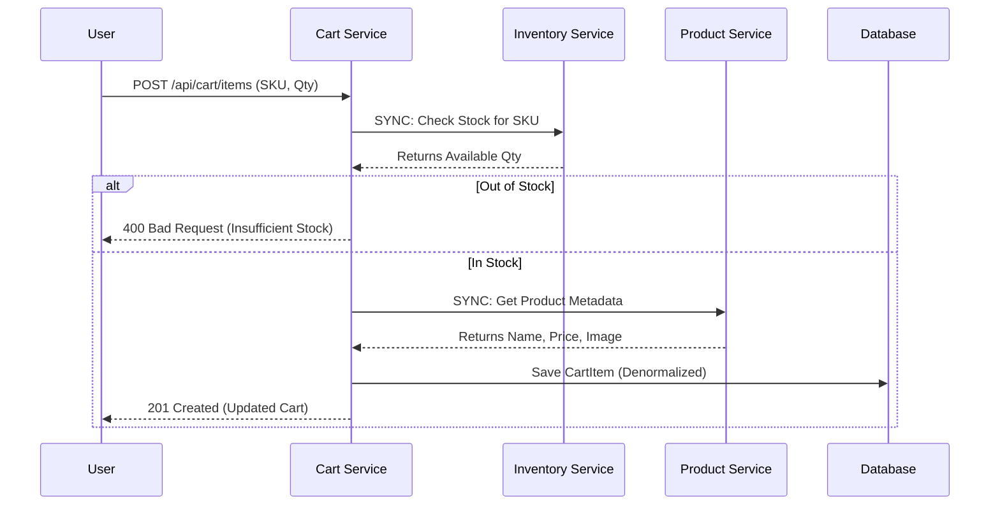

# 🛒 Cart Service 

The **Cart Service** acts as the temporary staging area for user purchases. It is a highly interactive service that strictly enforces business rules by synchronously verifying stock levels with the Inventory Service before allowing a user to reserve an item. It also features automated housekeeping to purge abandoned carts.

---

## 🚀 Core Responsibilities
* **Session Management:** Manages the lifecycle of a user's shopping cart, mapping items strictly to an authenticated `userId`.
* **Stock Verification (Sync):** Prevents users from adding out-of-stock items to their cart by querying the Inventory Service in real-time.
* **Metadata Hydration:** Fetches product details (name, price, image URL) from the Product Service to store a denormalized snapshot in the cart.
* **Automated Housekeeping:** Runs scheduled batch jobs to delete abandoned carts and free up database storage.

---

## 🛠️ Tech Stack & Patterns
* **Spring Cloud OpenFeign / WebClient:** Used for synchronous, real-time communication with the Product and Inventory services.
* **ModelMapper:** For clean, automated mapping between Cart Entities and Cart DTOs.
* **Spring Scheduling:** Utilizes `@Scheduled` for cron-based background maintenance tasks.
* **Batch Processing:** Implements a pagination/batching strategy for deleting old records to prevent database locking.

---

## 📡 API Documentation

### **Cart Endpoints**

| Method | Endpoint | Description | Auth |
| :--- | :--- | :--- | :--- |
| `GET` | `/api/cart` | Retrieve the current user's cart, total price, and item count. | `USER` |
| `POST` | `/api/cart/items` | Add a new SKU to the cart (triggers inventory check). | `USER` |
| `PUT` | `/api/cart/update` | Modify the quantity of an existing cart item. | `USER` |
| `DELETE` | `/api/cart/remove/{skuCode}` | Remove a specific product SKU from the cart entirely. | `USER` |
| `DELETE` | `/api/cart/clear` | Empty the cart manually. | `USER` |

---

## 🔄 Synchronous Integrations

When a user adds an item to their cart, this service performs a "Hydration & Verification" flow to ensure data integrity:

## 📨 Event-Driven Integration (RabbitMQ)

While the Cart Service primarily relies on synchronous calls for user actions, it acts as an **Asynchronous Consumer** to react to ecosystem events.

### 📥 Consumed Events (Listener)

| Queue | Routing Key | Expected Payload | Reaction |
| :--- | :--- | :--- | :--- |
| `cart.clear.queue` | `cart.clear` | `ClearCartEvent` | Automatically empties the user's cart after the Order Service successfully processes a checkout. |

*(Note: Triggering this via RabbitMQ prevents the checkout process from failing if the Cart database is temporarily slow or down).*

---

## ⏱️ Scheduled Background Jobs

To maintain database performance and comply with data retention policies, this service runs an automated housekeeping task:

* **Job:** `CartCleanupJob`
* **Schedule:** Every day at `2:00 AM` server time (`cron = "0 0 2 * * *"`).
* **Action:** Queries the database for carts that have not been modified in **30 days**.
* **Optimization:** Deletes records using a `do-while` batching strategy to ensure the database table is not locked during the cleanup of thousands of abandoned carts.