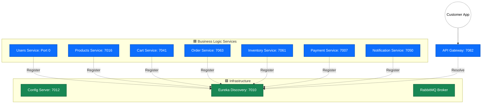

# 🔍 Eureka Discovery Server (MicroMart)

The **Eureka Discovery Server** is the central nervous system of the MicroMart ecosystem. It provides service registration and discovery, allowing microservices to locate and communicate with each other dynamically without hardcoded IP addresses or port numbers.

---

## 🚀 Core Responsibilities
* **Service Registration:** Maintains a real-time registry of all active microservice instances.
* **Health Monitoring:** Performs periodic heartbeats to ensure registered services are alive and healthy.
* **Load Balancing Support:** Provides the API Gateway and Feign Clients with the necessary metadata to perform client-side load balancing.
* **High Availability:** Configured to handle dynamic scaling where services (like the Users Service) may start on random ports (`0`).

---

## 🛠️ Tech Stack
* **Spring Cloud Netflix Eureka:** The industry-standard service discovery engine.
* **Spring Boot:** For rapid infrastructure bootstrapping.
* **Dashboard UI:** Built-in web console for real-time monitoring of service status.

---

## 🏗️ MicroMart System Topology

The following diagram visualizes how the Discovery Server sits at the heart of the platform, tracking every service across the infrastructure and business logic layers.

---

## 📡 Service Registry (Port Map)

| Service Name | Port | Type |
| :--- | :--- | :--- |
| **Eureka Server** | `7010` | Infrastructure |
| **Config Server** | `7012` | Infrastructure |
| **API Gateway** | `7082` | Edge / Routing |
| **Users Service** | `0` (Dynamic) | Business Logic |
| **Products Service**| `7016` | Business Logic |
| **Cart Service** | `7041` | Business Logic |
| **Inventory Service**| `7061` | Business Logic |
| **Order Service** | `7063` | Business Logic |
| **Notification** | `7050` | Business Logic |
| **Payment Service** | `7007` | Business Logic |

---

## 🔄 How it Works: The Heartbeat Mechanism

1.  **Registration:** When a service starts, it sends a POST request to Eureka on port `7010` with its IP, port, and health check URL.
2.  **Heartbeat:** Every 30 seconds, the service sends a "Renew" signal. If Eureka doesn't hear from a service for 90 seconds, it is automatically purged from the registry.
3.  **Discovery:** When the **API Gateway (7082)** receives a request for `/api/cart/**`, it asks Eureka for the location of the `Cart-Service`. Eureka provides the current IP/Port, and the Gateway routes the request.

---

## ⚙️ Configuration Notes
* **Self-Preservation:** In the event of a network glitch, Eureka enters "Self-Preservation" mode to prevent the accidental mass-deletion of healthy services.
* **Dashboard Access:** The registry can be viewed visually by navigating to `http://localhost:7010` in any web browser.