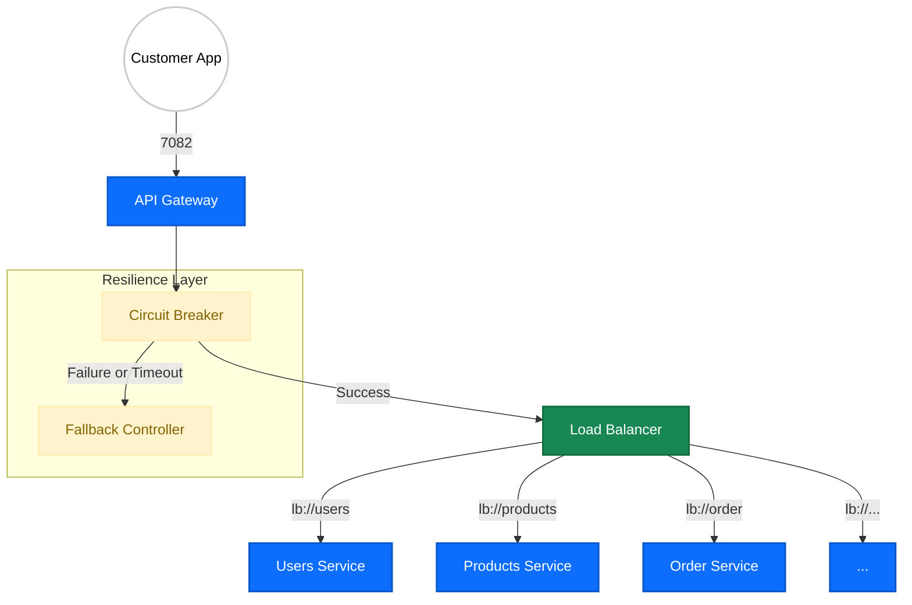

# 🚪 API Gateway (MicroMart)

The **API Gateway** is the single entry point for all client requests in the MicroMart ecosystem. It acts as an intelligent router, abstracting the internal microservice architecture from the frontend. It is responsible for cross-cutting concerns such as security (CORS), request transformation (Path Rewriting), and system resilience through automated Circuit Breaking.

---

## 🚀 Core Responsibilities
* **Unified Routing:** Dispatches incoming traffic to the correct downstream microservice using Eureka-backed load balancing (`lb://`).
* **Path Transformation:** Utilizes `RewritePath` filters to strip gateway prefixes, allowing internal services to maintain clean, context-free REST controllers.
* **Fault Tolerance:** Implements **Resilience4j Circuit Breakers** to prevent cascading failures. If a service (like Users) is slow or down, the gateway serves a graceful fallback response.
* **Security (CORS):** Manages a global Cross-Origin Resource Sharing policy to allow secure communication with the React/Angular frontend.
* **Observability:** Exposes Actuator endpoints for real-time monitoring of gateway health and route mappings.

---

## 🛠️ Tech Stack
* **Spring Cloud Gateway:** High-performance, reactive gateway built on Project Reactor.
* **Resilience4j:** Lightweight fault tolerance library (Circuit Breaker & Time Limiter).
* **Eureka Discovery:** Dynamically resolves service instances by name.
* **Spring Boot Actuator:** For operational monitoring and gateway management.

---

## 🏗️ Gateway Architecture

The Gateway intercepts every request, applies filters (Header removal, Path rewriting), and routes the traffic through a resilience layer.



---

## 📡 Route Configurations (Port: 7082)

The gateway maps public-facing URLs to internal service instances:

| Public Prefix | Internal Service | Logic | Fallback |
| :--- | :--- | :--- | :--- |
| `/users/**` | `lb://users` | Path Rewriting + Header Stripping | **Enabled** |
| `/products/**` | `lb://products` | Catalog access | Disabled |
| `/categories/**`| `lb://products` | Taxonomy access | Disabled |
| `/inventory/**` | `lb://inventory` | Stock management | Disabled |
| `/cart/**` | `lb://cart` | Shopping cart logic | Disabled |
| `/payment/**` | `lb://payment` | Financial processing | Disabled |
| `/order/**` | `lb://order` | Order fulfillment | Disabled |

---

## 🛡️ Resilience & Circuit Breaking

The Gateway is configured with a **sliding window** strategy to monitor service health. If the failure rate for the `Users Service` exceeds **50%**, the circuit opens for **10 seconds**.

### **Circuit Breaker Logic (Resilience4j)**
* **Timeout:** Requests are timed out after **5 seconds**.
* **Window Size:** Analysis is based on the last **10 calls**.
* **Fallback Controller:** When the circuit is open or a timeout occurs, the user receives a friendly reactive message instead of a raw 504 error.

```java
@RequestMapping("/fallback/users")
public Mono<String> userServiceFallback() {
        return Mono.just("⚠️ Users Service is taking too long or is down. Please try again later.");
        }
```

---

## 🔐 Global Security (CORS)

To support the MicroMart frontend, the gateway is configured to allow cross-origin requests from specific local development environments:

* **Allowed Origin:** `http://127.0.0.1:3000`
* **Allowed Methods:** `GET`, `POST`, `PUT`, `DELETE`, `OPTIONS`
* **Allowed Headers:** All (`*`)

---

## ⚙️ Operational Endpoints
| Endpoint | Description |
| :--- | :--- |
| `/actuator/gateway/routes` | View all active route mappings and filters. |
| `/actuator/health` | Check the overall health of the gateway. |
| `/actuator/beans` | List all initialized Spring Beans in the gateway context. |