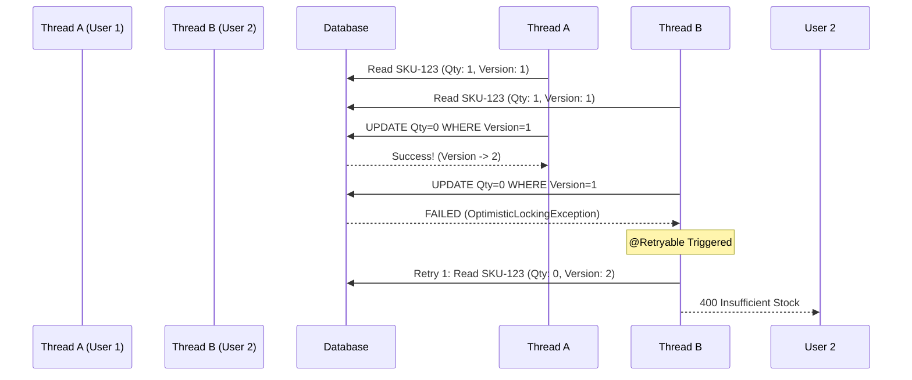

# 📦 Inventory Service (MicroMart)

The **Inventory Service** is the absolute source of truth for product availability within the MicroMart ecosystem. It is designed to handle high-concurrency environments, utilizing advanced locking mechanisms and reactive data fetching to ensure stock levels are never oversold, even during massive traffic spikes.

---

## 🚀 Core Responsibilities
* **Stock Management:** Maintains accurate, real-time counts of all product SKUs.
* **Concurrency Control:** Prevents "double-spending" of inventory when multiple users attempt to purchase the same final item simultaneously.
* **Asynchronous Fulfillment:** Listens to the Order Service to deduct stock quietly in the background after a checkout succeeds.
* **Data Aggregation:** Acts as a Backend-For-Frontend (BFF) for the Admin dashboard, actively merging raw stock counts with rich Product Metadata (images, names) on the fly.

---

## 🛠️ Tech Stack & Patterns
* **Spring Retry (`@Retryable`):** Implements automated backoff-and-retry logic specifically to handle `ObjectOptimisticLockingFailureException`.
* **Spring WebFlux (`WebClient`):** Uses non-blocking, reactive streams (`Flux`) to perform high-speed batch fetching of product details.
* **Pagination & Search:** Implements `Pageable` and keyword-based filtering for massive inventory registries.
* **RabbitMQ:** Listens to topic exchanges for distributed transaction fulfillment.

---

## 📡 API Documentation

| Method | Endpoint | Description | Auth |
| :--- | :--- | :--- | :--- |
| `GET` | `/api/inventory/sku-code/{sku-codes}` | Real-time stock check for a list of SKUs. | `INTERNAL` |
| `POST` | `/api/inventory/create` | Initialize stock tracking for a new SKU. | `ADMIN` |
| `PUT` | `/api/inventory/add` | Manually increase stock levels. | `ADMIN` |
| `PUT` | `/api/inventory/deduct` | Synchronously deduct stock (fallback to async). | `INTERNAL` |
| `GET` | `/api/inventory/all` | Paginated search of inventory (with metadata). | `ADMIN` |
| `GET` | `/api/inventory/registry` | Paginated raw registry view. | `INTERNAL` |

---

## 🛡️ Concurrency: The Anti-Oversell Architecture

To prevent two users from buying the exact same "last item in stock", this service uses **Optimistic Database Locking** combined with Spring's `@Retryable` annotation.

If a collision occurs, the system automatically waits 100ms and tries again (up to 3 times) before officially failing the transaction.

## 📨 Event-Driven Integration (RabbitMQ)

While admins can manually adjust stock via REST, the standard e-commerce flow relies on asynchronous messaging to ensure the Order Service isn't blocked waiting for database locks.

### 📥 Consumed Events (Listener)

| Queue | Routing Key | Expected Payload | Reaction |
| :--- | :--- | :--- | :--- |
| `inventory.deduct.queue` | `inventory.deduct` | `DeductStockEvent` | Iterates through the order's line items and permanently deducts the purchased quantities from the database. |

---

## ⚡ Reactive-to-Imperative Bridging

When the Admin dashboard requests the full inventory (`/api/inventory/all`), the service avoids the "N+1 query problem" by doing a single, massive batch request to the Product Service using WebFlux. It then safely bridges the reactive `Flux` back to the imperative thread using `.block()` to merge the `ProductMetadata` with the `Inventory` entities before returning the page.