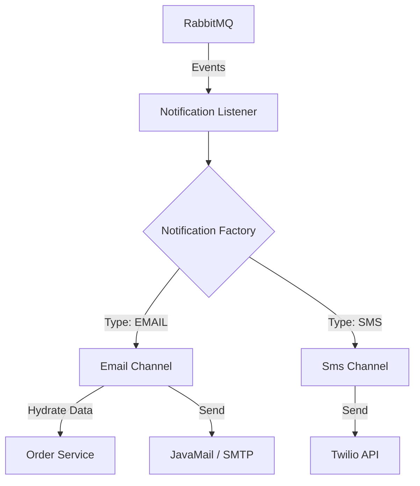
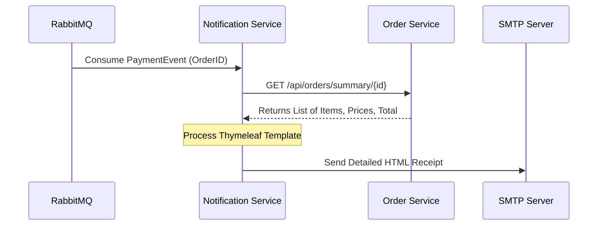
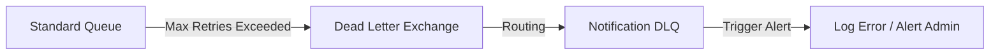

# 🔔 Notification Service 

The **Notification Service** is the communication engine of the MicroMart ecosystem. It acts as a pure asynchronous consumer, listening for system-wide events and dispatching multichannel alerts (HTML Email and SMS). It features a "Hydration" pattern where it calls back to the Order Service to enrich raw event data with full line-item details before dispatching receipts.

---

## 🚀 Core Responsibilities
* **Multi-Channel Dispatch:** Supports professional HTML emails via **JavaMail/Thymeleaf** and SMS via **Twilio**.
* **Event Orchestration:** Centralizes all system alerts (Welcome emails, Password Resets, Payment Confirmations, and Reactivation campaigns).
* **Data Enrichment (Hydration):** Uses `WebClient` to fetch full order summaries from the Order Service to provide rich, detailed receipts to customers.
* **Fault Tolerance:** Implements a **Dead Letter Exchange (DLX)** pattern to capture and log failed notification attempts for manual intervention.

---

## 🛠️ Tech Stack & Patterns
* **Thymeleaf:** Server-side template engine used to generate responsive HTML emails.
* **Twilio SDK:** For global SMS delivery.
* **Factory Design Pattern:** Dynamically selects the delivery channel (`Email` vs `Sms`) based on the incoming event type.
* **Spring WebFlux (`WebClient`):** For non-blocking synchronous calls to the Order Service.
* **RabbitMQ DLQ:** Configured with `x-dead-letter-exchange` to ensure zero message loss during provider outages.

---

## 🏗️ Notification Architecture

The service uses a Factory pattern to decouple the event listeners from the actual delivery logic, allowing for easy extension to new channels like WhatsApp or Push Notifications in the future.

---

## 📨 Event-Driven Integration (RabbitMQ)

This service is a "Passive Consumer." It does not have a REST controller; instead, it reacts to routing keys across multiple exchanges.

### 📥 Consumed Events (Listener)

| Exchange | Routing Key | Queue | Reaction |
| :--- | :--- | :--- | :--- |
| `user.exchange` | `user.created` | `user.notification.queue` | Sends Verification Email + Welcome SMS. |
| `user.exchange` | `password.reset`| `password.reset.queue` | Sends Secure Password Reset Link. |
| `user.exchange` | `user.reactivation`| `user.reactivation.queue` | Sends "We Miss You" Re-engagement Email. |
| `micromart.exchange` | `payment.status.updated` | `payment.notification.queue` | Sends Payment Success/Cancelled Alerts. |
| `micromart.exchange` | `notification.receipt` | `notification.receipt.queue` | Sends Detailed Order Receipt with Tracking. |

---

## 🔄 Asynchronous Hydration Flow

When a payment is confirmed, the notification service receives only the `orderId`. It must "hydrate" this data to show the user exactly what they bought.

---

## 🛡️ Fault Tolerance: Dead Letter Queue (DLQ)

To prevent the system from "forgetting" an important email if the SMTP server is down, all queues are bound to a **Dead Letter Exchange**.

* **Logic:** If a listener throws an exception, the message is retried. After reaching the retry limit, RabbitMQ moves the message to `notification.dlq`.
* **Monitoring:** The `DLQListener` monitors this queue and logs a `DEAD LETTER ALERT` with the original source queue and the failure reason (extracted from headers).

---

## 🔧 Configuration Details
* **Retry Strategy:** Exponential backoff is handled by Spring AMQP.
* **Trusted Packages:** `Jackson2JsonMessageConverter` is configured to trust all packages for polymorphic event deserialization.
* **Template Location:** `src/main/resources/templates/` (contains `verification-email.html`, `password-reset.html`, etc.)