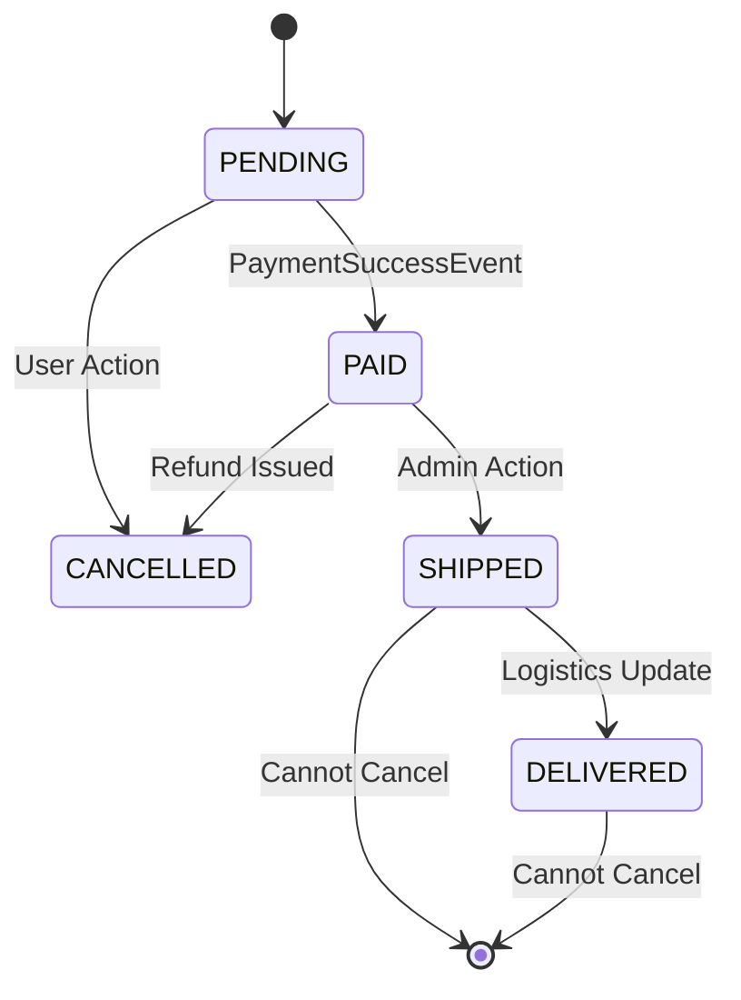

# 📦 Order Service (MicroMart)

The **Order Service** is the central orchestrator of the MicroMart ecosystem. It manages the entire lifecycle of a customer's purchase—from initial checkout to final fulfillment or cancellation. It is designed to be **event-aware**, reacting to payment successes and inventory shifts asynchronously.

---

## 🚀 Core Responsibilities
* **Transaction Orchestration:** Coordinates between Cart, Payment, and Inventory.
* **Order Lifecycle Management:** Handles state transitions (`PENDING` → `PAID` → `SHIPPED` → `DELIVERED`).
* **Secure Access:** Enforces that users can only view their own orders while allowing Admins global visibility.
* **Audit Trail:** Maintains a strict history of order creation and cancellation reasons.

---

## 🛠️ Tech Stack & Patterns
* **Spring Data JPA:** For persistent storage in a dedicated PostgreSQL/MySQL instance.
* **MapStruct:** For high-performance, type-safe mapping between Entities and DTOs.
* **Slug-based Identifiers:** Uses `OrderUtils` to generate non-sequential, professional order numbers (e.g., `ORD-2026-X8Y2`) instead of exposing raw DB IDs.
* **Pagination:** Implements `Pageable` for efficient retrieval of large order histories.

---

## API Documentation

### **Customer Endpoints**

| Method | Endpoint | Description | Auth |
| :--- | :--- | :--- | :--- |
| `POST` | `/api/orders` | Create a new order from cart items. | `USER` |
| `GET` | `/api/orders/{orderNo}` | Fetch details of a specific order. | `OWNER` |
| `GET` | `/api/orders/my-orders/paginated` | Get current user's order history. | `USER` |
| `PUT` | `/api/orders/{orderNo}/cancel` | Cancel an order before it ships. | `OWNER` |

### **Admin Endpoints**

| Method | Endpoint | Description | Auth |
| :--- | :--- | :--- | :--- |
| `GET` | `/api/orders/admin/status` | Filter all system orders by status. | `ADMIN` |
| `GET` | `/api/orders/admin/date-range` | Audit orders within a specific timeframe. | `ADMIN` |

---

## 🔄 Business Logic: The Cancellation Flow
The service implements a protected cancellation state machine. An order can **only** be cancelled if it has not yet reached the `SHIPPED` or `DELIVERED` status.

## 📨 Event-Driven Integration (RabbitMQ)

The Order Service relies heavily on asynchronous messaging to maintain loose coupling with the rest of the MicroMart ecosystem. It utilizes a centralized exchange (`MICROMART_EXCHANGE`) to broadcast and listen for domain events.

### 📤 Published Events (Producer)
When an order is successfully created or paid, this service broadcasts the following events:

| Exchange | Routing Key | Payload | Description |
| :--- | :--- | :--- | :--- |
| `MICROMART_EXCHANGE` | `inventory.deduct` | `DeductStockEvent` | Instructs the Inventory Service to reserve/deduct stock for the purchased items. |
| `MICROMART_EXCHANGE` | `cart.clear` | `ClearCartEvent` | Commands the Cart Service to empty the user's shopping cart post-checkout. |
| `MICROMART_EXCHANGE` | `notification.receipt`| `OrderReceiptEvent` | Triggers the Notification Service to dispatch a confirmation email/receipt to the user. |

### 📥 Consumed Events (Listener)
To maintain data consistency, the Order Service listens for downstream updates:

| Queue | Expected Payload | Reaction |
| :--- | :--- | :--- |
| `order.payment.success` | `PaymentSuccessEvent` | Updates the local order status from `PENDING` to `PAID`. |
| `order.inventory.failed`| `InventoryShortageEvent`| If stock is insufficient, triggers a rollback and updates status to `CANCELLED`. |

---

## 🧪 Testing & Quality
This service maintains high test coverage focusing on the `OrderServiceImpl`.
* **Unit Tests:** Verify total calculation logic and state transition guards.
* **MockMvc Tests:** Ensure RBAC (Role-Based Access Control) correctly blocks users from seeing other users' orders.
* **JaCoCo Coverage:** Focused on core Business Logic (filtering out DTOs/Entities).