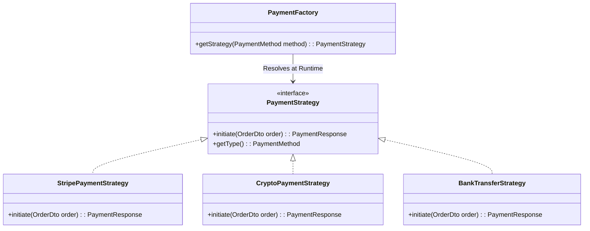
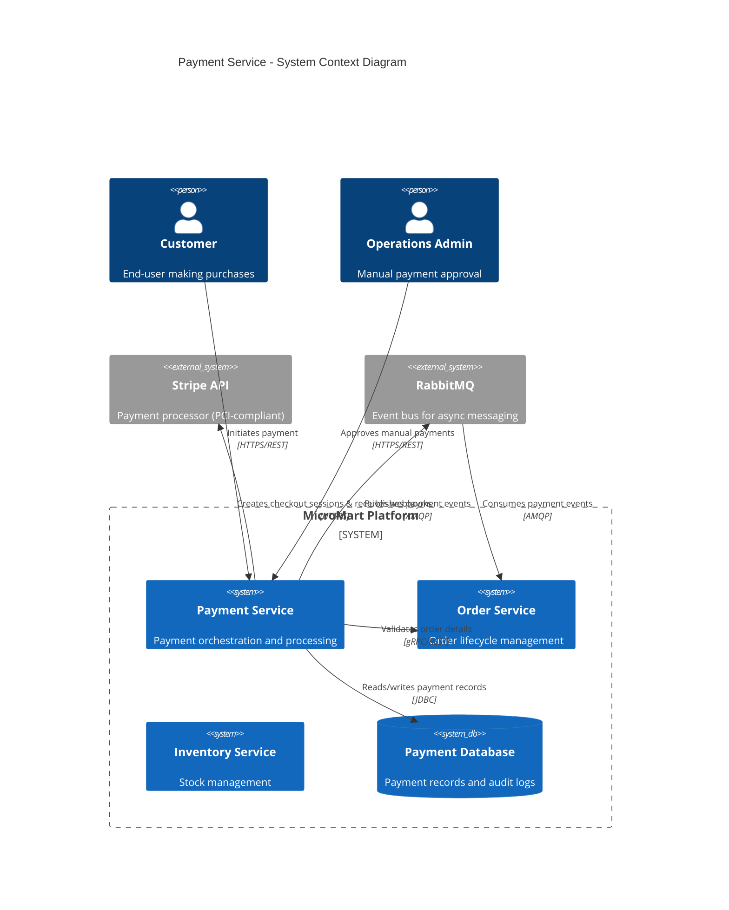
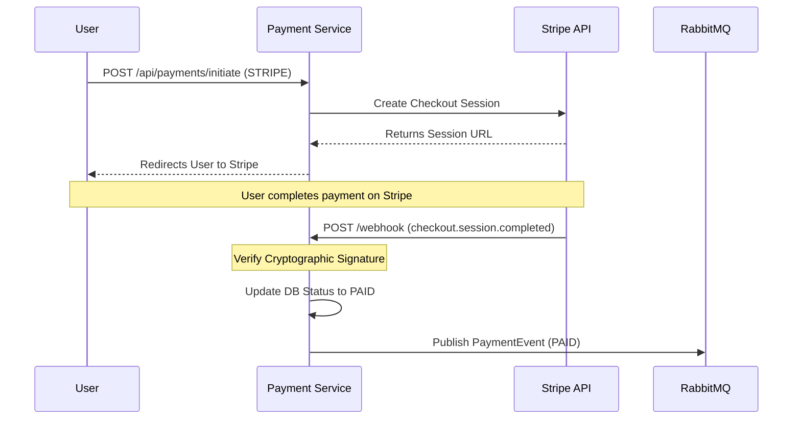

# 💳 Payment Service (MicroMart)

The **Payment Service** is the financial gateway of the MicroMart ecosystem. It abstracts the complexity of multiple payment processors (Stripe, Crypto, Manual Bank Transfers) behind a unified, polymorphic API interface. It strictly relies on asynchronous webhooks and RabbitMQ messaging to guarantee that orders are never marked as "Paid" unless funds are cryptographically or manually verified.

---

## 🚀 Core Responsibilities
* **Omnichannel Processing:** Supports Credit Cards (Stripe), Cryptocurrency (Mock), and Manual Bank Transfers.
* **Webhook Handling:** Actively listens to Stripe's external webhook events to prevent front-end spoofing.
* **State Management:** Manages payment lifecycles (`PENDING`, `AWAITING_TRANSFER`, `PAID`, `FAILED`, `CANCELLED`).
* **Automated Housekeeping:** Runs scheduled sweepers to reclaim inventory for abandoned checkout sessions.

---

## 🛠️ Tech Stack & Patterns
* **Strategy Design Pattern:** Utilizes a `PaymentFactory` to dynamically inject the correct payment processor (`StripeStrategy`, `CryptoStrategy`, `BankTransferStrategy`) at runtime based on the user's request.
* **Stripe SDK:** Native integration for secure, PCI-compliant Checkout Sessions.
* **Spring Scheduling (`@Scheduled`):** Runs automated fixed-rate jobs to sweep the database for timed-out transactions.
* **RabbitMQ:** Acts as the single source of truth, broadcasting verified payment statuses back to the Order Service.

---

## 📡 API Documentation

### **Customer Endpoints**

| Method | Endpoint | Description | Auth |
| :--- | :--- | :--- | :--- |
| `POST` | `/api/payments/initiate` | Initiates a payment session and returns either a Stripe URL, a Crypto QR Code, or Bank Instructions based on the requested strategy. | `USER` |
| `GET` | `/api/payments/status/{ref}`| Check the current status of a specific payment reference. | `PUBLIC` |

### **Admin Endpoints**

| Method | Endpoint | Description | Auth |
| :--- | :--- | :--- | :--- |
| `GET` | `/api/payments/pending` | Fetch all payments awaiting manual bank transfer or crypto verification. | `ADMIN` |
| `POST` | `/api/payments/approve` | Manually mark an offline payment as `PAID`. | `ADMIN` |

### **External Integrations**

| Method | Endpoint | Description | Used By |
| :--- | :--- | :--- | :--- |
| `POST` | `/api/payments/webhook` | Receives and cryptographically verifies events like `checkout.session.completed`. | `Stripe API` |

---

## 🧠 Architecture: The Strategy Pattern

To prevent massive `if-else` blocks in the core service, this application uses the Strategy Pattern. The `PaymentFactory` automatically maps the `PaymentMethod` enum to the correct Spring Bean implementing the `PaymentStrategy` interface.

---

## 🏗️ System Context

---

## 🔄 Asynchronous Verification (Webhook Flow)

For security, the frontend never dictates the payment status. If a user pays via Stripe, the system waits for Stripe's secure webhook to confirm the transaction before broadcasting the success event to the MicroMart ecosystem.

---

## 📨 Event-Driven Integration (RabbitMQ)

Once a payment is definitively verified (either via Webhook or Admin Manual Approval), this service broadcasts the final state.

### 📤 Published Events (Producer)

| Exchange | Routing Key | Payload | Description |
| :--- | :--- | :--- | :--- |
| `micromart.exchange` | `payment.status.updated` | `PaymentEvent` | Triggers the Order Service to update the final Order Status to `PAID`, `CANCELLED`, or `FAILED`. |

---

## ⏱️ Scheduled Background Jobs

To ensure that unpaid orders don't hold up inventory indefinitely, a sweeper job constantly monitors the database.

* **Job:** `PaymentSweeperService.sweepAbandonedPayments()`
* **Schedule:** Runs every 30 minutes (`fixedRate = 1800000`).
* **Action:** Queries the database for any payment stuck in the `PENDING` state for more than 120 minutes.
* **Result:** Automatically updates the status to `CANCELLED` and fires a `PaymentEvent` to RabbitMQ, instructing the Order Service to cancel the order and release the reserved inventory.