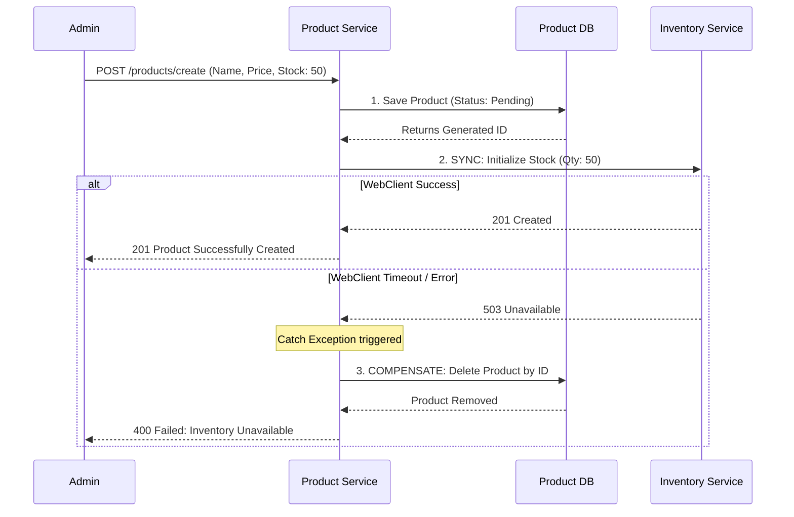

# 🏷️ Product Service (MicroMart)

The **Product Service** serves as the core catalog for the MicroMart ecosystem. It manages all product details, taxonomies (categories), and dynamically generates SKUs. It acts as the primary data provider for both customer browsing and internal service hydration.

---

## 🚀 Core Responsibilities
* **Catalog Management:** Handles the complete lifecycle (CRUD) of Products and Categories.
* **SKU Generation:** Dynamically generates consistent, human-readable SKU codes based on brand, name, and variant attributes.
* **Metadata Provider:** Acts as a synchronous data source for the Cart and Inventory services, providing rich details (names, prices, image URLs) to augment raw database IDs.
* **Data Integrity (Saga):** Enforces distributed transaction integrity when creating new products by rolling back database writes if downstream Inventory initialization fails.

---

## 🛠️ Tech Stack & Patterns
* **Spring WebFlux (`WebClient`):** Used for outbound REST communication to initialize stock in the Inventory Service.
* **Saga Pattern (Compensating Transactions):** Ensures that a product is not saved to the database without a corresponding stock record.
* **Spring Data JPA:** Manages relational mapping between Products and Categories.
* **Pagination & Sorting:** Utilizes `@PageableDefault` and `@SortDefault` to optimize massive catalog queries and keyword searches.

---

## 📡 API Documentation

### **Product Endpoints**

| Method | Endpoint | Description | Auth |
| :--- | :--- | :--- | :--- |
| `POST` | `/products/create` | Create a new product and initialize inventory stock. | `ADMIN` / `PROFILE_CREATE` |
| `PUT` | `/products/update/{id}` | Update product details. | `ADMIN` / `PROFILE_UPDATE` |
| `DELETE` | `/products/{id}` | Permanently delete a product. | `ADMIN` / `PROFILE_DELETE` |
| `GET` | `/products/view/{id}` | Get product by internal DB ID. | `READ_ONLY` |
| `GET` | `/products/sku/{skuCode}`| Get product by public SKU code. | `PUBLIC` |
| `GET` | `/products` | Get all products (paginated). | `PUBLIC` |
| `GET` | `/products/search` | Search products by name or description keyword. | `PUBLIC` |

### **Category Endpoints**

| Method | Endpoint | Description | Auth |
| :--- | :--- | :--- | :--- |
| `POST` | `/categories/create` | Create a new taxonomy category. | `ADMIN` |
| `DELETE` | `/categories/{id}` | Delete a category (blocked if products exist). | `ADMIN` |
| `GET` | `/categories/all` | Retrieve all categories. | `PUBLIC` |

### **Internal Integration Endpoints**

| Method | Endpoint | Description | Used By |
| :--- | :--- | :--- | :--- |
| `GET` | `/products/metadata/{sku}` | Fetch localized metadata for a single item. | `Cart Service` |
| `POST` | `/products/metadata/batch` | Fetch metadata for multiple SKUs in one call. | `Inventory BFF` |

---

## 🛡️ Distributed Data Integrity (The Saga Pattern)

When an Admin creates a new product, the system must write to the `Product` database *and* the `Inventory` database. Because these are separate microservices, a standard `@Transactional` annotation is not enough.

This service implements a **Compensating Transaction** to ensure data consistency:

