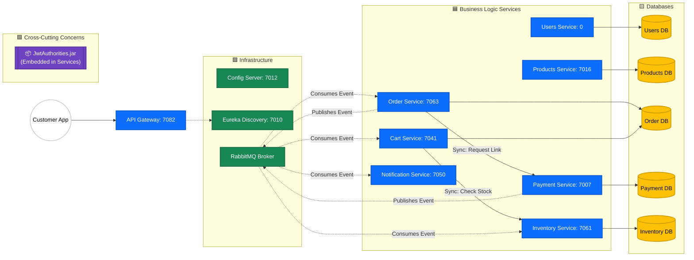
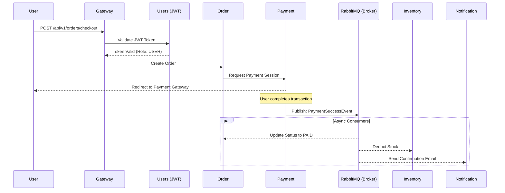

# 🛒 MicroMart: Enterprise E-Commerce Ecosystem


MicroMart is an enterprise-grade, distributed e-commerce ecosystem built on a reactive, event-driven architecture. Designed for high availability and elastic scalability, the platform demonstrates sophisticated patterns including distributed transactions (Saga), reactive data streams, and automated resilience.
---
> **🏆 Roadmap.sh Project:** This repository is my official solution for the [Scalable E-Commerce Platform](https://roadmap.sh/projects/scalable-ecommerce-platform) architecture challenge.
---
## 🏗️ System Architecture

This ecosystem follows the **API Gateway Pattern**, **Service Discovery Pattern**, and the **Database-per-Service Pattern** to ensure high scalability and loose coupling.



### 📊 Diagram Legend

| Shape & Color          | Node Type            | Description                                                        |
| :--------------------- | :------------------- | :----------------------------------------------------------------- |
| ⚪ **White Circle** | **External Actor** | The end-user client (Mobile/Web App).                              |
| 🟦 **Blue Rectangle** | **Business Service** | Independent microservices handling core domain logic.              |
| 🟩 **Green Rectangle** | **Infrastructure** | Backbone services supporting the ecosystem (Routing, Messaging).   |
| 🟨 **Yellow Cylinder** | **Database** | Isolated persistence layers (Database-per-Service pattern).        |
| 🟪 **Purple Box** | **Shared Library** | Reusable `.jar` dependencies embedded at compile-time.             |

**Communication Lines:**
* `───>` **Solid Line:** Synchronous HTTP/REST Call (Blocking)
* `- - ->` **Dotted Line:** Asynchronous Message / Event-Driven Flow (Non-Blocking)

---

## 🔄 The Transaction Lifecycle

When a user places an order, the following distributed transaction occurs across the ecosystem:



---

## 🛡️ Resilience & Observability

MicroMart is built with a **"Design for Failure"** mindset. The API Gateway serves as a resilient entry point using:

* **Circuit Breakers (Resilience4J):** Configured with a state-machine for high-risk routes (like `Users`).
    * **Trip Logic:** If the failure rate hits **50%** over a rolling window of **10 calls**, the circuit opens to halt traffic.
    * **Self-Healing (Half-Open):** After a **10-second wait time**, the Gateway allows exactly **3 test requests** through. If they succeed, the circuit closes and normal traffic resumes; if they fail, it trips open again.
* **Time Limiting:** Strict **5-second timeouts** ensure that a hanging downstream service does not exhaust the Gateway's thread pool.
* **Global CORS:** Securely configured for modern frontend integration (e.g., React on port 3000).
* **Observability:** Integrated with **Spring Boot Actuator** for real-time health checks and metric gathering.

---

## 📦 Service Registry

| Service | Primary Responsibility | Port   |
| :--- | :--- |:-------|
| **Gateway** | Unified entry point, routing, and load balancing | `7082` |
| **ConfigServer** | Centralized configuration management | `7012` |
| **EurekaServer** | Service registration and dynamic discovery | `7010` |
| **Users** | Identity management and RBAC (Role-Based Access Control) | `0`    |
| **Products** | Catalog management and product metadata | `7016` |
| **Cart** | Real-time shopping cart persistence | `7041` |
| **Order** | Transaction orchestration and checkout flow | `7063` |
| **Inventory** | Stock tracking and safety-stock logic | `7061` |
| **Payment** | Transaction processing and billing history | `7007` |
| **Notification** | Multi-channel messaging (Email/SMS) via RabbitMQ | `7050` |
| **JwtAuthorities** | **[Library]** Reusable security filters and token logic | `N/A`  |

---

## 🚀 Local Development Setup

### 1. Install Shared Library
Because `JwtAuthorities` is a custom internal library, it must be installed to your local `.m2` repository first:
```bash
cd JwtAuthorities && mvn clean install
```

### 2. Build All Services
```bash
mvn clean package -DskipTests
```

### 3. Run via Docker Compose
```bash
docker-compose up --build
```