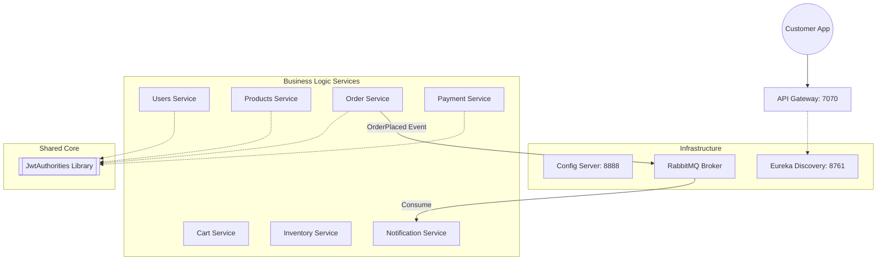

# 🛒 MicroMart: Enterprise E-Commerce Ecosystem

MicroMart is a high-availability, event-driven e-commerce backend built on a **Microservices Architecture**. It features 10 independent services orchestrated via Spring Cloud, synchronized through a shared security library, and integrated via RabbitMQ.

---

## 🏗️ System Architecture

This ecosystem follows the **API Gateway Pattern** and **Service Discovery Pattern** to ensure high scalability and loose coupling.

